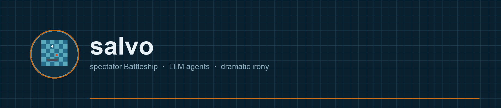
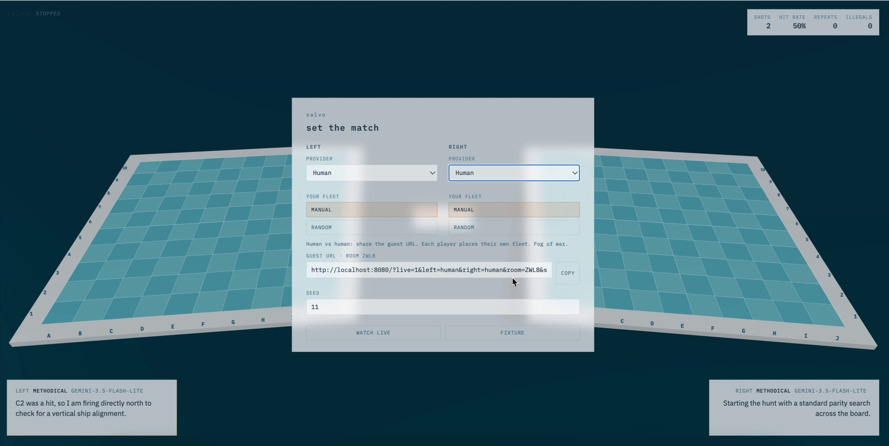
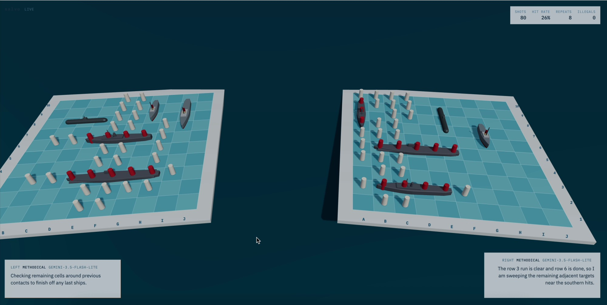

<p align="center">
  
</p>

<p align="center"><em>the interesting moment is total confidence about a square the viewer already knows is empty water</em></p>

<p align="center">
  <strong>Spectator-first Battleship.</strong>
  Two LLM agents, a human and an agent, or two humans play a standard 10×10 game.
  A Three.js client renders <strong>both</strong> boards to the viewer, including the information neither agent has.
</p>

<p align="center">
  <a href="LICENSE"></a>
  <a href="pyproject.toml">=3.12"/></a>
  <a href="client/package.json"></a>
  <a href="#play"></a>
  <a href="tests/test_no_leak.py"></a>
</p>

<p align="center">
  <a href="#quick-start">Quick start</a> ·
  <a href="#play">Play</a> ·
  <a href="#providers">Providers</a> ·
  <a href="#replay">Replay</a> ·
  <a href="#development">Development</a> ·
  <a href="CLAUDE.md">Spec</a> ·
  <a href="https://www.youtube.com/watch?v=oMn8Xv64j0U">Gameplay</a>
</p>

---

This is entertainment, not a benchmark. Every design decision resolves in favor of making that moment of dramatic irony legible on screen. If a change makes the game stronger but the drama weaker, it is the wrong change.

Python referee + FastAPI (`salvo`) and a thin TypeScript client (`@salvo/client`). The referee owns game truth; the browser is a projection of an event stream.

<p align="center">
  <a href="https://www.youtube.com/watch?v=oMn8Xv64j0U"></a>
</p>
<p align="center">
  <a href="https://www.youtube.com/watch?v=oMn8Xv64j0U"></a>
</p>

<p align="center">
  ▶ <a href="https://www.youtube.com/watch?v=oMn8Xv64j0U"><strong>Watch gameplay on YouTube</strong></a>
</p>

## Quick start

**Docker** (ADC from `../google_account`, never baked into the image):

```bash
cp .env.example .env   # optional API keys
docker compose up --build
```

Open [http://localhost:8080/](http://localhost:8080/).

**Local:**

```bash
uv sync && uv run pytest
uv run uvicorn salvo.server.app:app --reload

# other terminal
cd client && npm install && npm run dev
```

Open [http://localhost:5173/](http://localhost:5173/). The Vite proxy forwards `/ws`, `/catalog`, and `/logs` to the API on `:8000`.

Token-free smoke match (bots, no browser):

```bash
uv run python -m salvo.cli --left occupancy --right random --seed 42
```

## Play

The setup overlay is provider-first. Pick left/right, persona, speech, seed, then **WATCH LIVE**. **FIXTURE** plays a recorded sample with no server.

| Mode | What you see |
|---|---|
| **LLM vs LLM** | Both fleets visible. Omniscient spectator show. |
| **Human vs AI** | You place **your** board only. The AI fleet is fogged until a ship is sunk (or match end). Click the opponent board to fire. |

**Human vs human** is a different game: there is no omniscient spectator, just fog of war. Two browsers, one 4-character room. Pick Human on one side first (host), then Human on the other — a guest URL appears. Both fleets default to manual. Each player places and sees only their own ships until sink / end.

Speech is orthogonal to persona: **STANDARD** (English `say`) or **PROFANE RUSSIAN (16+)** (`raw-ru`). JSON keys and cells stay `E5`; the overlay never enters the opponent’s observation. `say` is spectator-only — there is no trash-talk channel.

### URL cheatsheet

```
# LLM vs LLM (Vertex defaults)
http://localhost:8080/?live=1&left=gemini&right=opus&speech_left=raw-ru&speech_right=standard&seed=1

# Human vs AI
http://localhost:8080/?live=1&left=human&right=gemini-3.5-flash-lite&place_left=manual&seed=1

# Human vs human (host left; guest uses the URL from the setup overlay)
http://localhost:8080/?live=1&left=human&right=human&room=AB23&seat=left&place_left=manual&place_right=manual&seed=1
```

CLI helper that prints a live client URL:

```bash
gcloud auth application-default login   # Vertex
uv run python -m salvo.cli live --left gemini-3.5-flash --right claude-sonnet-4-6 --seed 1

# Gemini API / Anthropic API instead of Vertex
uv run python -m salvo.cli live --left gemini --provider-left gemini --right opus --provider-right anthropic

# Ollama (Docker rewrites localhost → host.docker.internal)
uv run python -m salvo.cli live --left ollama --right gemini --seed 1
```

## Providers

Keys stay on the server and never go to the client. Copy `.env.example` → `.env`. `GET /catalog` is the setup menu.

| Provider | Auth | Notes |
|---|---|---|
| **Vertex AI** | Application Default Credentials | Gemini + Vertex-hosted Claude (`claude-opus-4-6`). Direct by default; optional ADK Plan-ReAct per side (`adk_left=1`). Set `GOOGLE_CLOUD_PROJECT`. |
| **Gemini API** | `GEMINI_API_KEY` | Google AI Studio. Direct only. |
| **Anthropic** | `ANTHROPIC_API_KEY` | `claude-sonnet-5`, `claude-opus-5`. Direct or ADK (`AnthropicLlm`). |
| **OpenAI** | `OPENAI_API_KEY` | default `gpt-5.4-nano`. Direct or ADK (`OpenAILlm`). |
| **Ollama** | `OLLAMA_URL` (default `http://localhost:11434`) | Direct only. `format: json`, `think: false`. `OLLAMA_THINK=1` turns CoT on. |

Bots `parity`, `occupancy`, and `random` implement the same turn contract as LLM players. They are token-free fixtures, not a ranking system. `occupancy` counts remaining legal ship poses (including no-touch) and fires the densest unfired cell.

## Replay

Every match writes `logs/<match_id>.jsonl` (gitignored): header (seed, placements, model ids, prompt hashes) then one line per event.

```bash
uv run python -m salvo.cli replay logs/<match_id>.jsonl --pace 1.5
```

The replay endpoint streams the log to the client with **zero LLM calls**. Iterate on visuals against recordings.

## Coordinates

Canonical form everywhere: column `A–J`, then row `1–10`, uppercase, no separator. `E5`. Not `5E`, not `e5`. Case and whitespace in agent output are forgiven; transposition is an illegal move and is logged as one.

## Development

```bash
uv sync && uv run pytest
cd client && npm install && npm run build
```

Highest-priority test: `tests/test_no_leak.py` — the rendered prompt for side A must contain no coordinate from side B’s placement. If that breaks, the dramatic irony is fake.

Python 3.12+, Node 22 for the client build.

Agent-facing design contract (architecture, event stream, non-negotiables, non-goals): [CLAUDE.md](CLAUDE.md).
